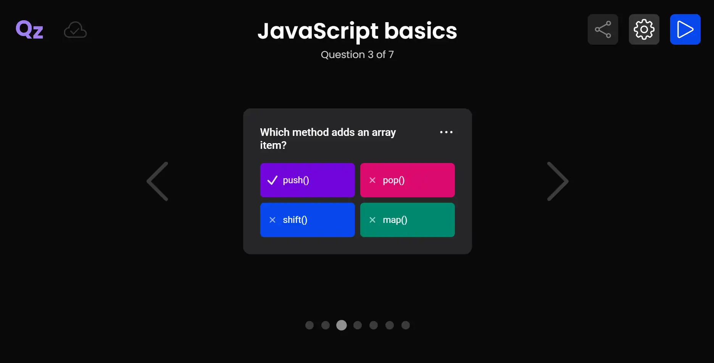
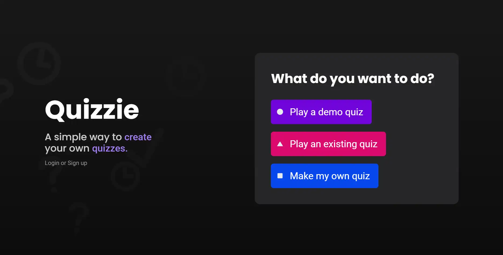
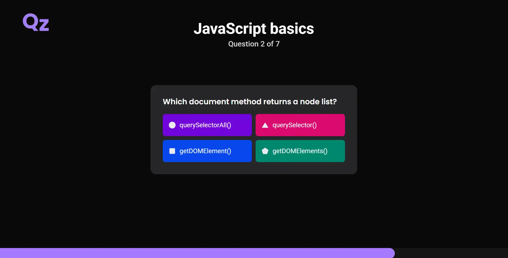
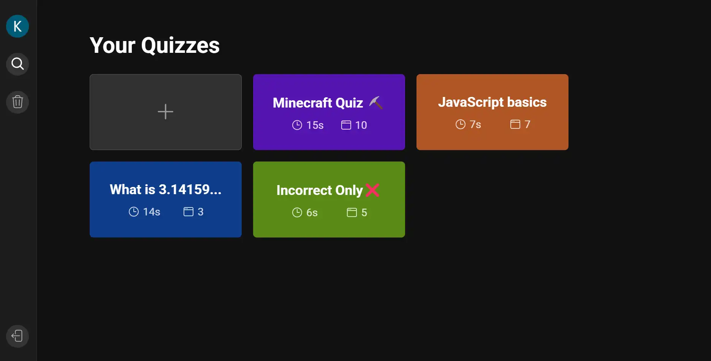

# Quizzie

Quizzie is a simple web application that allows you to **create** and share quizzes.
Jump into the app and play public quizzes instantly — no account needed 🪄

If you want to test the editor and are not logged in, the quiz you create will be saved locally in your browser and uploaded to your account once you login 😌. However, having an account allows you to create multiple quizzes and share them with others.

Complete the quiz and see your score at the end, if you got at least 2 stars out of 3, confetti will be thrown at you to celebrate your achievement 🎉

## Features ✨

- Play quizzes with a smooth UI with polished animations.
- Create quizzes with a easy-to-use editor.
- Share quizzes with others.

## Creating quizzes 📝

The editor is a simple and intuitive tool that allows you to create quizzes with ease. Click on the **+** button on your dashboard to create a new quiz.

Here are some cool features/rules 📏

- You can click on the **Play** button at the top right corner to play the quiz. Once playing, the app will recognize you as the quiz owner and will allow you to jump back to the editor.
- You can add up to **15 questions** to your quiz. Each question can have up to **4 answers**.
- Answers can be displayed as either a list or a grid.
- Clicking on the **Settings** button at the top right corner will allow you to randomize the order of the questions, answers, colors, set the duration of the questions and whether to show the icons or not.
- Click on the **Share** button at the top right corner to copy the public link to your quiz.
- **Your quizzes are saved automatically** (there's also a cloud icon to show you the save status for online quizzes), so don't worry about losing your work.

## More screenshots 📸

## Technologies Used 💻

- React
- Node.js
- Express
- MongoDB
- Zustand
- Vite
- Zod
